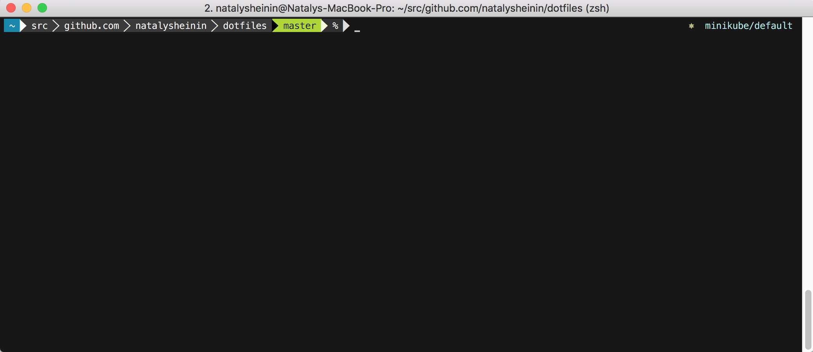

# Terminal

## Configuration

1. Install iTerm + set it to default
2. Install zsh as the shell
3. Configure .zshrc file
4. Download themes/fonts: [powerline-shell](https://github.com/b-ryan/powerline-shell), [kubernetes-context theme](https://github.com/KnVerey/k8s-workflow-utils)
